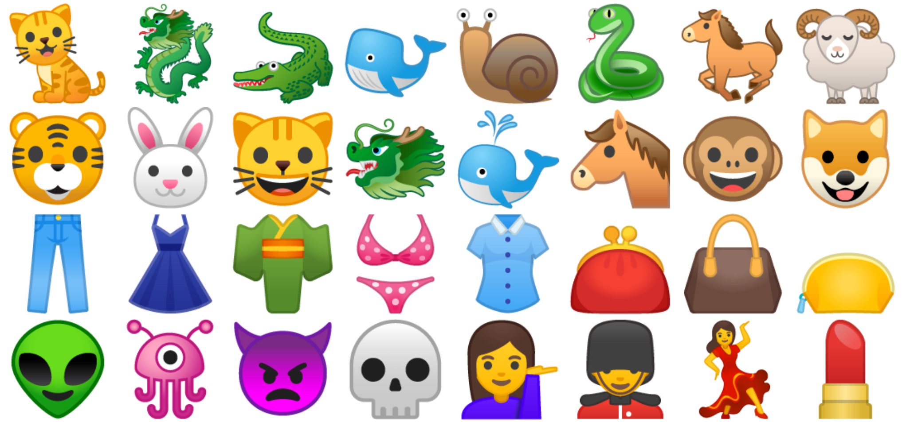

I wanted to explore utf-8 a bit via python3.<br>

I started by writing and running<br>
```python3 smiley_raw.py```<br>

I cleaned up some unrendered characters by hands<br>

After that I removed all the break lines characters via<br>
```tr -d '\n' < smiley_raw.txt > smileys.txt```<br>

And here is final <a href="https://raw.githubusercontent.com/andrey-fadeev/smiley_utf8/master/smileys.txt" target="_blank">result</a><br>

Also, I did notice two packs of 12 clock icons, so I decide to animate them a bit. Just run<br>
```python3 clock.py```